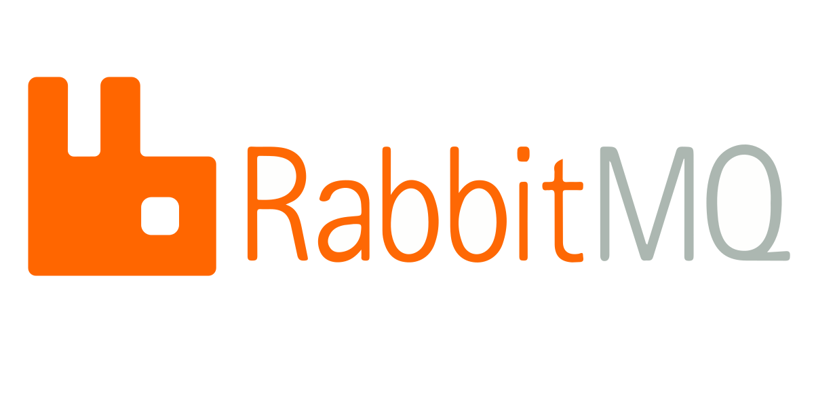

# :triangular_flag_on_post: RabbitMQ

## 🎯 RabbitMQ'ya neden ihtiyaç duyulmaktadır?

**RabbitMQ, dağıtık sistemler arasında iletişimi kolaylaştıran ve asenkron mesajlaşma sağlayan bir mesaj kuyruklama aracıdır. İşte RabbitMQ'ya duyulan ihtiyaçtan bazı nedenler:**

- **Sistemler arasında bağımlılıkları azaltır: Mesaj kuyruklama sayesinde, farklı bileşenler veya sistemler arasındaki iletişim bağımsız hale gelir. Böylece, bir bileşenin çalışmaması diğerlerini etkilemez.**
- **Asenkron iletişimi sağlar: RabbitMQ, mesajların kuyrukta toplanması ve tüketilmesi üzerine çalışır. Bu sayede, bir bileşen mesajı gönderdikten sonra hemen yanıt beklemek zorunda kalmaz ve diğer işlere odaklanabilir.**
- **Yük dengelemesi ve ölçeklenebilirlik: RabbitMQ, çoklu sunucu ve kuyruk kümesi oluşturma yetenekleri sayesinde yük dengelemesi ve ölçeklenebilirlik sağlar. Bu, yoğunluklu mesaj trafiğine daha iyi yanıt verebilme ve talepleri paralel olarak işleyebilme avantajı sunar.**

## 🎯 RabbitMQ özellikleri nelerdir?

- **Mesaj kuyruklama: Mesajlar kuyrukta toplanır ve tüketici tarafından alınır.**
- **Yayınlama/abonelik: Bir üretici, mesajı birden çok tüketiciye yayınlayabilir ve tüketici yalnızca kendi ilgilendiği mesajları alır.**
- **Mesaj yönlendirme: Mesajlar, belirli bir kurala göre yönlendirilebilir. Bu kural, mesajın hedef tüketiciye nasıl iletileceğini belirler.**
- **Ölçeklenebilirlik: RabbitMQ, kümelenme ve yük dengeleme yetenekleriyle ölçeklenebilirlik sağlar.**
- **Acknowledgement (Onaylama): Bir tüketici, bir mesajı başarılı bir şekilde işledikten sonra onaylama yaparak RabbitMQ'ya mesajın alındığını bildirir.**

## 🎯 RabbitMQ avantajları nelerdir?

- **Esneklik: RabbitMQ, farklı platformlar ve programlama dilleriyle uyumlu olacak şekilde tasarlanmıştır. Bu, farklı bileşenler arasında esnek bir şekilde mesajlaşmayı sağlar. Üreticiler ve tüketiciler istedikleri teknoloji ve dil kullanarak RabbitMQ'yu entegre edebilir.**
- **Dayanıklılık: RabbitMQ, mesajları kaydetme ve geri yükleme yeteneklerine sahiptir. Bu, sunucu arızası, ağ sorunları veya sistem yeniden başlatma gibi beklenmedik durumlarda bile mesajların korunmasını sağlar. Mesajlar güvenli bir şekilde işlenir ve hiçbir mesaj kaybolmaz.**
- **Yük Dengelemesi ve Ölçeklenebilirlik: RabbitMQ, çoklu sunucu ve kuyruk kümesi oluşturma yeteneklerine sahiptir. Bu, yük dengelemesi sağlayarak talebe göre ölçeklendirme yapabilmenizi sağlar. Yoğun mesaj trafiğinde, RabbitMQ sunucuları talebi paylaşabilir ve daha fazla mesaj trafiğini işleyebilirsiniz.**
- **Mesaj Yönlendirme ve Yayınlama/Abonelik: RabbitMQ, mesajları belirli kurallara göre yönlendirebilir. Mesajların ilgili tüketicilere doğru şekilde iletilmesini sağlar. Ayrıca yayınlama/abonelik modelini destekler, yani bir üretici mesajı birden çok tüketiciye yayınlayabilir ve ilgili tüketiciler sadece kendi ilgilendikleri mesajları alır.**
- **Asenkron İletişim: RabbitMQ, mesaj kuyruklama modeliyle asenkron iletişimi kolaylaştırır. Üreticiler mesajları hemen gönderir ve tüketiciler kendi hızlarında mesajları alır ve işler. Bu, sistemler arasında daha esnek ve verimli bir iletişimi sağlar.**
- **Hata Yönetimi: RabbitMQ, mesajları işleme sırasında oluşabilecek hatalara karşı sağlam bir hata yönetimi mekanizması sunar. Başarısızlık durumunda mesajlar yeniden kuyruğa gönderilebilir veya başka bir işlem hatası durumunda işlenmeyen mesajlar işlenebilir. Bu sayede sistemdeki hatalar kontrol altında tutulabilir.**

**Bu avantajlar, RabbitMQ'nun dağıtık sistemler arasında güvenilir, esnek ve ölçeklenebilir bir iletişim sağlamasını sağlar.**

## 🎯 Teknik Özellikleri Nelerdir?

- **Producer**: Mesajı atan kaynak yani uygulamadır. Redis’deki Pub/Sub düşünüldüğünde Publisher tarafıdır.
- **Queue** : Gönderilen mesajlar alıcaya ulaştırılmadan önce bir sıraya konur. Gelen yoğunluğa göre veya alıcıya erişilemediği durumlarda, gelen tüm mesajlar Queue’de yani memory’de saklanır. Eğer bu süreç uzun sürer ise memory şişebilir. Ayrıca server’ın restart edilmesi durumunda ilgili mesajlar kaybolabilir.
- **Consumer**: Gönderilen mesajı karşılayan sunucudur. Yani Redis Pub/Sub’daki Subscribe’dır. Kısaca ilgili kuyruğu(Queue)’yu dinleyen taraftır.
- **Fifo**: RabbitMQ’da giden mesajların işlem sırası first in first out yani ilk giren ilk çıkar şeklindedir.
- **Exchange:** Producer’dan gelen mesajları kuyruğa iletmek üzere  kabul eder.  Exchange, aldığı mesajla ne yapacağını bilmelidir.  Routing key yardımı ile  mesajı ilgili kuyruğa iletmektedir.
- **Exchance Type:**   ****Mesajın hangi “queue” ye ne şekilde iletileceğini belirtir. 4 tane exchange tipi bulunmaktadır Direct, Topic, Fanout,Header.
- **Binding:** Exchance ve queue arasındaki bağlantıdır.

## 🎯 Mesajlaşma mimarileri nelerdir?

### Direct Exchange (Doğrudan Yayılım)

**Direct exchange, mesajları belirli bir yönlendirme anahtarı (routing key) kullanarak ilgili kuyruklara yönlendiren bir yayılım tipidir. Üretici, mesajları belirli bir yönlendirme anahtarıyla etiketler ve bu anahtarla ilgili kuyruklara yönlendirilir. Tüketiciler, ilgilendikleri anahtarla eşleşen mesajları alır. Bu yayılım tipi, mesajların spesifik bir hedefe iletilmesini sağlar.**

### Fanout Exchange (Yayılım)

**Fanout exchange, mesajları kuyruklara doğrudan yönlendirme yapmadan, bağlı olan tüm kuyruklara eş zamanlı olarak yayınlayan bir yayılım tipidir. Üretici, mesajları fanout exchange'e gönderir ve bu exchange bağlı tüm kuyruklara mesajları kopyalar. Tüm kuyruklar aynı mesajları alır. Bu yayılım tipi, mesajların genel bir yayılma (broadcast) yapısında iletilmesini sağlar. Örneğin, bir olay veya güncelleme mesajının birden çok tüketici tarafından işlenmesi gerektiğinde kullanılabilir.**

### Topic Exchange (Konu Tabanlı Yayılım)

**Topic exchange, yönlendirme anahtarlarını kullanarak mesajları ilgili kuyruklara yayınlayan bir yayılım tipidir. Üretici, mesajları belirli bir konu (topic) adıyla etiketler ve bu konu adıyla ilgili kuyruklara yönlendirilir. Tüketiciler, ilgilendikleri konu adıyla eşleşen mesajları alır. Konu adları genelde nokta (.) ile ayrılan bir yapıya sahiptir, örneğin "haber.finans", "haber.sporda" gibi. Bu yayılım tipi, mesajların esnek bir şekilde filtrelenmesini ve hedeflenen kuyruklara iletilmesini sağlar.**

**Bu yayılım tipleri, RabbitMQ'da mesajların farklı şekillerde yönlendirilmesini ve yayılmasını sağlar. Hangi yayılım tipinin kullanılacağı, mesajların nasıl iletilmesi gerektiğine bağlıdır ve sistem gereksinimlerine göre tercih edilebilir.**
