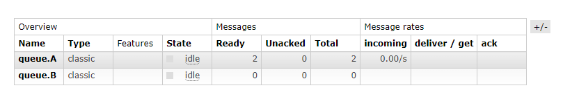
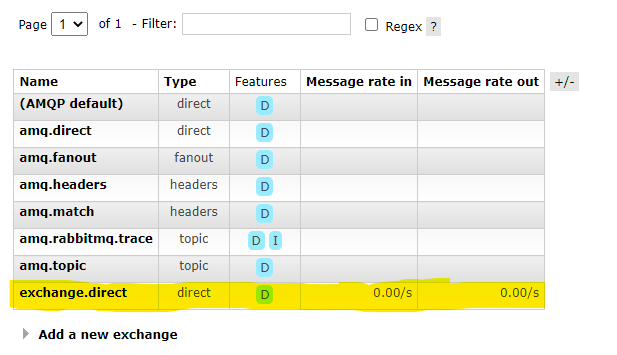
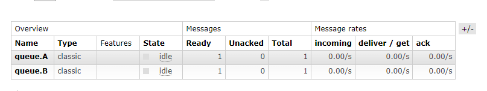
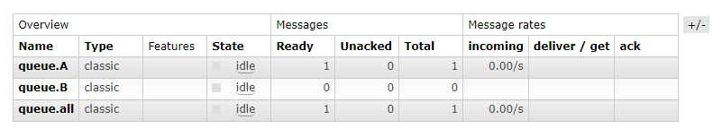

# Consumer

<b> Bu kısımdan post ile gönderilimiş isteği dinleyip inceleme işlemini gerçekleştiriyoruz.</b>

## Direct ile işlem yaptığımızda

Tüketicilerin, ilgilendikleri anahtarla eşleşen mesajları alır. Bu yayılım tipi, mesajların spesifik bir hedefe iletilmesini sağlamaktadır demiştik buna göre oluşacak senaryo şu şekildedir :

Spesifik olarak "queue.A"yı belirttiğimiz için sadece Ready olacak olan kuyruk "queue.A olacaktır"

## Fanout ile işlem yaptığımızda
Üretici, mesajları fanout exchange'e gönderir ve bu exchange bağlı tüm kuyruklara mesajları kopyalar. Tüm kuyruklar aynı mesajları aldığından bahsetmiştik buna göre oluşacak senaryo şu şekildedir :

Gönderdiğimiz istek hem "queue.A" hem de "queue.B" ye düşmektedir.

## Topic ile işlem yaptığımızda

Üretici, mesajları belirli bir konu (topic) adıyla etiketler ve bu konu adıyla ilgili kuyruklara yönlendirilir. Tüketiciler, ilgilendikleri konu adıyla eşleşen mesajları alır.

Bu kısımda gönderdiğimiz istek "queue.A" olduğu için hem "queue.A" hem de "queue.all" tarafına düşmektedir. B tarafından istek atsaydık sonucumuz "queue.B" ve "queue.all" şeklinde olacaktı.
Bu Topic işlemindeki isteği konsolda bakacak olursak şu şekilde olmaktadır :
